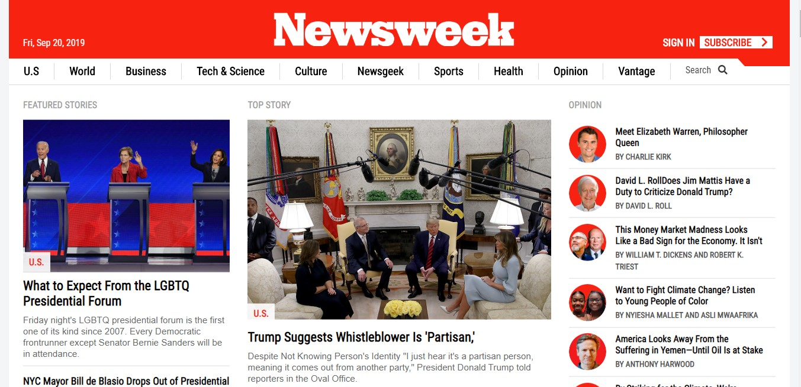

# Project Name
The News Week Page Clone

## Table of contents
* [General info](#general-info)
* [Setup  & Live Preview](#setup)
* [Screenshots](#screenshots)
* [Technologies](#technologies)
* [Features](#features)
* [Status](#status)
* [Contact](#contact)

## General info
The above project was undertaken so as to use a css framework (bootstrap) to build a site that actually uses it, the <a href="https://www.newsweek.com/">news week</a> website. It is also used as a practical study case on building website with responsive design. The above mentioned website is one dedicated to the dissemination of information on current developments and happenings around the world. It is created and built by <a href="https://github.com/adaorachi">MaryAnn Chukwuka</a>.

## Setup & Live Preview
This project is built with the basic web page structures and styling. It is pretty simple to setup. All you have to do is to clone the project into your local repository.
Find attached below a preview of the project:  
<a href="https://raw.githack.com/adaorachi/newsweek/master/index.html">The News Week clone page </a>

## Screenshots
  
Find below attached some screenshots taken from our re-design of the webpage:

1. <a href="images/screenshot1.jpg">screenshot-one</a> 
2. <a href="images/screenshot2.jpg">screenshot-two</a> 
3. <a href="images/screenshot3.jpg">screenshot-three</a> 
4. <a href="images/screenshot4.jpg">screenshot-four</a> 
5. <a href="images/screenshot5.jpg">screenshot-five</a> 

## Technologies
* HTML5
* CSS3

## Features
List of features ready and TODOs for future development
* We do not have any future or TODO development for now. We will definitely give out a notice should we decide to.

## Status
The project is currently finished.

## Contact
Created by [@MaryAnn Chukwuka](https://github.com/adaorachi), feel free to contact me!
